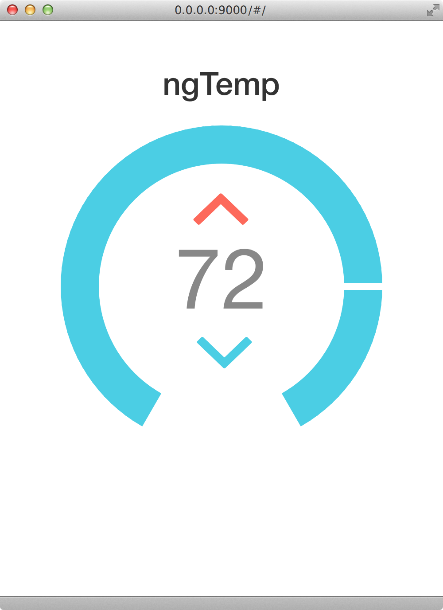
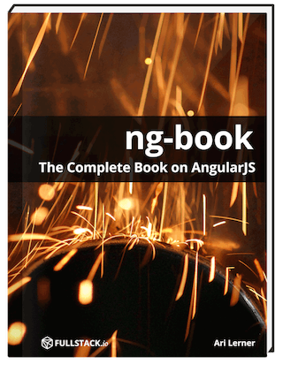

% Powering Human Interaction
% powering the arduino with angular

## Ari Lerner, Fullstack.io

- Author of [ng-book](https://ng-book.com)
- Author of a few others ([D3 on Angular](http://leanpub/d3angularjs), [Riding Rails with AngularJS](https://leanpub.com/angularjs-rails))
- Teacher at [HackReactor](http://hackreactor.com)
- Cofounder of [Fullstack.io](http://fullstack.io)
- Background in distributed computing and infrastructure

## What

Let's prototype a temperature control system in less than 20 minutes using the Arduino, an open-source hardware platform and Angular

## Arduino?

- Embedded systems
- Wearable computing
- Low-power systems

## Overview

- Running an HTTP server on the arduino
- Requesting the HTML from the arduino
- Loading angular app
- Communicating to Angular from the Arduino
- Communicating to the Arduino from Angular

## Running an HTTP server

An HTTP server written in C... it's hard... 

---------------------

```c
void loop() {
  // listen for incoming clients
  EthernetClient client = server.available();
  if (client) {
    while (client.connected()) {
      if (client.available()) {
        char c = client.read();
        if (c == '\n' && currentLineIsBlank) {
          client.println("HTTP/1.1 200 OK");
          client.println("Content-Type: text/html");
          client.println("Connection: close");
          client.println();
          client.println("<h1>Hi from the Arduino</h1>");
          break;
        }
        if (c == '\n') { currentLineIsBlank = true; } 
        else if (c != '\r') { currentLineIsBlank = false; }
      }
    }
    delay(1);
    client.stop();
  }
}
```

## Enter TinyWebServer

Enables simplification of the c HTTP server code

-----------------------

```c
#include <TinyWebServer.h>

// Index handler
boolean index_handler(TinyWebServer& web_server) {
  web_server.print(F("<html><head><title>Web server</title></head>"));
  web_server.print(F("<body></body></html>"));
  return true;
}

// Handlers
TinyWebServer::PathHandler handlers[] = {
  {"/pins/digital", TinyWebServer::POST, &digital_pin_handler},
  {"/pins", TinyWebServer::GET, &pins_handler},
  {"/", TinyWebServer::GET, &index_handler },
  {NULL},
};

const char* headers[] = {
  "Content-Length", "X-Action-Len", NULL
};
TinyWebServer web = TinyWebServer(handlers, headers);
// ...
void loop() {
  web.process();
};
```

## Connecting to the net

- Ethernet shield
- Wifi shield

```c
#include <Ethernet.h>
byte ip[] = { 192, 168, 0, 67 };
// ...
Ethernet.begin(mac, ip);
```

_DHCP_ is also supported

## But where's the HTML

## Options

#### Embed HTML in Arduino
#### Read/Send from SD card
#### Load from remote server

## Using browser functionality

-------------------------

```html
const char *HOST = "aridev:9000";
// ...
boolean index_handler(TinyWebServer& web_server) {
  // ...
  web_server.print(F("<script id=\"appscript\" src=\"http://"));
  web_server.print(HOST);
  web_server.print(F("/scripts/scripts.js\"></script>"));
  // ...
};
```

## But where's the Angular

----------------------------------

```javascript
(function() {
  var scriptTag = document.getElementsByTagName('script')[0];
  // ...
  createLinkTag('styles/main.css');

  var arr = [
    'scripts/modules/arduino.js',
    'scripts/app.js'
    // ...
  ];

  createScriptTag('bower_components/angular/angular.js');
  createScriptTag('bower_components/angular-route/angular-route.js');

  arr.forEach(function(src) { createScriptTag(src); });
  // Bootstrap
  body.setAttribute('ng-app', 'myApp');
  var app   = document.createElement('div');
  var main  = document.createElement('div');
  main.setAttribute('main-view', '');
  app.appendChild(main);
  body.appendChild(app);
})();
```

## Command and Control

* Arduino -> Angular (√)
* Angular -> Arduino (...)

## Expose the local ip to the browser

```c
boolean index_handler(TinyWebServer& web_server) {
  // ...
  web_server.print(F("<script>window.ip=\""));
  web_server.print(ip_to_str(ip));
  web_server.print(F("\"</script>"));
  // ...
};
```

-----------

```javascript
angular.module('fsArduino', [])
.provider('Arduino', function() {
  this.setRootUrl = function(u) {
    rootUrl = u || rootUrl;
  };

  this.$get = function($http) {
    return {
      getPins: function() {},
      setPins: function() {}
    };
  }

});
```

```javascript
angular.module('myApp', [
  'fsArduino'
])
.config(function(ArduinoProvider) {
  ArduinoProvider.setRootUrl(window.ip);
});
```

## Summary of hardware hacking

- Turning pins on/HIGH
- Turning pins off/LOW
- Measuring pin voltage

## Getting pin status

```javascript
// ...
getPins: function() {
  return $http({
    method: 'GET',
    url: rootUrl + '/pins'
  }).then(function(data) {
    return data.data;
  });
},
// ...
```

## Serving pin status

```c
// GET /pins
boolean pins_handler(TinyWebServer& web_server) {
  web_server.send_error_code(200);
  web_server.send_content_type("application/javascript");
  web_server.end_headers();
  pinsToString(web_server);
  return true;
}
// ...
bool pinsToString(TinyWebServer& web_server) {
  web_server << F("{\"pins\":[");
  int len = numPins;
  for(int i=0; i<len; i++){
    web_server << F("{\"pin\":");
    web_server << pins[i].getPin();
    web_server << F(",\"value\":");
    web_server << pins[i].getState();
    web_server << F("}");
    if ((i+1) < len) web_server << F(",");
  }
  web_server << F("]}");
  return true;
}
```

## Modifying pin states

Angular works with JSON by default (just javascript), but the Arduino does not... However, parsing a schemaless data structure in a strictly typed language is... <span class="emp">difficult</span>.

## Create our own protocol

Turn JSON from:

```javascript
{ pin: 7, action: 'getTemp' } (24 bytes)
```

to

```c
p7a0 (4 bytes)
```

## Actions

```javascript
  // in mainview directive
  Arduino.setPins([
    { pin: temp, action: 'getTemp' }
  ]);
  // in Arduino provider
  var actions = {
    'getTemp': 0
  };
  var actionifyPins = function(pins) {
    var str = '';
    for (var i = 0; i < pins.length; i++) {
      var p = pins[i];
      str += 'p' + p.pin;
      if (typeof(p.mode) !== 'undefined') {str += 'm' + p.mode;}
      if (typeof(p.value) !== 'undefined') {str += 'v' + p.value;}
      if (typeof(p.action) !== 'undefined') {str += 'a' + actions[p.action];}
    }
    return str;
  };
```
-------------

```javascript
{ pin: 7, action: 'getTemp' } (24 bytes)
```

to

```c
p7a0 (4 bytes)
```

## Using it service

```javascript
setPins: function(pins) {
  var strAction = actionifyPins(pins);
  return $http({
    method: 'POST',
    url: rootUrl + '/pins/digital',
    data: strAction,
    headers: {'X-Action-Len': strAction.length}
  }).then(function(data) {
    return data.data;
  });
}
```

## Parsing in c

```c
enum ActionTypes {
  GETTEMP
};
// POST /pins/digital
boolean digital_pin_handler(TinyWebServer& web_server) {
  // Get the action length
  const char* action_str_len = web_server.get_header_value("X-Action-Len");
  int len = atoi(action_str_len);
  
  // Get the request data based on the length
  char* data = (char*)malloc(len);
  if (data) memset(data, 0, len);
  get_request_data(web_server, len, data);
  
  // ...
};
```

## Continued

```javascript
int sLen = strlen(data);
int i = 0;
while(i < sLen) {
  if (data[i] == 'p') {
    // We are parsing a new pin
    pinInt = (int)(data[++i] - '0');
    Pin *p = select_pin(pinInt);
    while(data[i++] != 'p' && i < sLen) {
      // We're in a pin object
      switch (data[i]) {
        case 'a':
          i++;
          actionInt = (int)(data[i] - '0');
          actionT = (ActionTypes)(actionInt);
          switch (actionT) {
            case GETTEMP:
              currTemp = getTemp(ds);
              p->setCurrentValue(currTemp);
              break;
          // ...
```
-----------------------------

```c
float getTemp(OneWire sensor){
  //returns the temperature from one DS18S20 in DEG Celsius
  byte data[12], addr[8];
  float celsius, fahrenheit;

  sensor.search(addr);
  sensor.reset();
  sensor.select(addr);
  sensor.write(0x44,1);
  delay(1000);

  byte present = sensor.reset();
  sensor.select(addr);  
  sensor.write(0xBE);

  for (int i = 0; i < 9; i++) { data[i] = sensor.read(); }

  sensor.reset_search();
  byte MSB = data[1];
  byte LSB = data[0];

  int16_t raw = (data[1] << 8) | data[0]; raw = raw << 3;
  if (data[7] == 0x10) { raw = (raw & 0xFFF0) + 12 - data[6]; }

  celsius = (float)raw / 16.0;
  fahrenheit = celsius * 1.8 + 32.0;
  return fahrenheit;
}
```

## Interface

Finally, we want to show the data in a meaningful, _sexy_ way... 

## Demo

-------------------



## d3

-------------------------------------

```javascript
angular.module('myApp')
  .service('D3', function D3() { return window.d3; })
  .directive('temperatureGauge', function(D3) {
    return {
      template: '<div class="thermometer"><svg></svg></div>',
      scope: { 'ngModel': '=' },
      restrict: 'EA',
      link: function (scope, element, attrs) {
        var el = D3.select('.thermometer'),
            w = attrs.width || el.node().clientWidth,
            h = attrs.height || el.node().clientHeight,
            r = Math.min(w, h) / 2,
            pi = Math.PI;

        var svg = el.select('svg')
              .attr('width', w)
              .attr('height', h)
              .append('g')
              .attr('transform', 'translate(' + w/2 + ',' + h/2 + ')');
        // ...
      } 
    };
  });
```

## Learn more




## Thanks

### Ari Lerner, Fullstack.io